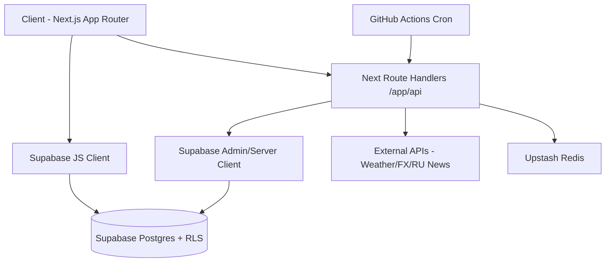

# Picnic 웹 서비스 개발 기술 문서

- 문서 목적: 신규/외부 개발자가 **Picnic 전체 기능과 작동 원리**를 빠르게 이해하고 바로 개발에 참여할 수 있도록 하기 위함
- 기준 코드베이스: `/Users/seongmincho/Documents/New project`
- 작성일: 2026-03-07
- 서비스 대표 슬로건: **해외 거주 도시 기반 한국인 교민 플랫폼**

---

## 1. 서비스 개요

Picnic은 러시아 거주 한국인을 위한 모바일 우선 웹 서비스다. 핵심 도메인은 아래 3개다.

1. 중고거래
2. 동네생활(커뮤니티)
3. 오늘의 피크닉(날씨/환율/공지/실시간 뉴스)

서비스 전반은 다음 원칙으로 설계되어 있다.

- 도시 기반 개인화: 모스크바/상트 기반 데이터 필터링
- 거래 신뢰: 브레드 등급 + 거래 리뷰 + 신고 시스템
- 노출 최적화: 최근 3일 랭킹 + 밀크 부스트
- 모바일 UX 최적화: iOS Safari 키보드/스크롤/하단 safe-area 대응
- 운영 내구성: 다중 캐시, 폴백, 크론 동기화, 권한 분리

---

## 2. 기술 스택

### 2.1 Frontend

- Next.js 15 (App Router)
- React 18 + TypeScript
- Tailwind CSS v4
- Radix UI / shadcn 스타일 컴포넌트
- Recharts (환율 차트)
- Sonner (토스트)
- next-themes (라이트/다크)

### 2.2 Backend / DB

- Supabase (Auth + Postgres + Realtime + Storage + RLS)
- Next.js Route Handlers (`/app/api/*`)

### 2.3 인프라/운영

- Vercel 배포
- Upstash Redis (뉴스 캐시/레이트리밋)
- Resend (알림 메일)
- PostHog / Vercel Analytics / Speed Insights

---

## 3. 전체 아키텍처



핵심 분리:

- 사용자 세션 기반 데이터 접근: Supabase Client + RLS
- 권한/보안 민감 처리: Server/Admin client + API route
- 대량/외부 API 의존 기능(뉴스/메일/크론): 서버 라우트에서 흡수

---

## 4. 라우트 구조

### 4.1 사용자 페이지

- `/` : 랜딩
- `/login`, `/signup`, `/verify-email`, `/forgot-password`, `/reset-password`
- `/onboarding/step/1~5`
- `/feed` : 중고거래 목록
- `/post/new`, `/post/[id]` : 게시물 작성/상세
- `/community`, `/community/new`, `/community/[id]`
- `/chats`, `/chats/[roomId]`
- `/today`, `/today/russia-news`
- `/notifications`
- `/profile/[userId]`, `/settings`

### 4.2 관리자/개발자 페이지

- `/admin`
- `/admin/reports`
- `/admin/users`

### 4.3 API

- 인증: `/api/auth/*`, `/auth/callback`
- 채팅: `/api/chat/*`, `/api/chat-rooms/[roomId]`
- Today: `/api/exchange-rates*`, `/api/russia-news*`
- 크론: `/api/cron/notification-emails`, `/api/cron/russia-news-sync`, `/api/cron/milk-role-bonus`
- 운영: `/api/admin/users`

---

## 5. 인증/온보딩 작동 원리

### 5.1 인증 흐름

- 이메일 가입: Supabase `signUp`, 인증 메일 링크는 `/auth/callback?next=/onboarding/step/1`
- 소셜(현재 UI 활성: Google): Supabase OAuth 후 `/auth/callback`
- Kakao 커스텀 OAuth 라우트 존재 (`/api/auth/kakao*`)하나 UI 기본은 비활성

### 5.2 `/auth/callback` 핵심 로직

1. 토큰/코드 교환
2. 프로필 존재 확인(없으면 fallback upsert)
3. `onboarding_completed`, `full_name`, `city` 검사
4. 온보딩 필요 시 `/onboarding/step/1`, 완료 시 `/feed`

### 5.3 미들웨어 가드

`/middleware.ts`에서:

- 공개 경로 제외 모든 페이지 인증 체크
- 미인증 사용자 로그인 리다이렉트
- 온보딩 미완료 사용자 온보딩 강제
- 보안 헤더 및 Server-Timing 헤더 추가

---

## 6. 사용자 컨텍스트/캐시

`/lib/contexts/UserContext.tsx`

- `auth.getUser()` + `profiles` 조회
- 2단계 캐시:
  - 메모리 캐시(Map)
  - `localStorage` 캐시 (TTL 5분)
- `refreshProfile()`로 강제 동기화 지원
- auth state change 구독으로 세션 변경 반영

---

## 7. 기능별 상세

## 7.1 중고거래 (Feed + Post)

### 7.1.1 목록 정렬

`get_ranked_posts` RPC 사용.

- 최근 3일 게시물: 랭킹 점수 기반 정렬
- 3일 초과 게시물: 최신순 폴백
- 랭킹 요소:
  - 좋아요/관심/조회 로그 스코어
  - 밀크 부스트 점수
  - 시간 감쇠

### 7.1.2 상태 처리

상태값: `active`, `reserved`, `sold`, `hidden`

- 목록 노출 기본: `active`, `reserved`
- `sold`는 목록 기본 제외
- `hidden`/`is_hidden=true`는 일반 사용자 제외
- 개발자는 `p_include_hidden=true`로 숨김 게시물 조회 가능

### 7.1.3 상호작용

- 좋아요: `post_likes`
- 관심: `post_interests`
- 조회수: 노출 기반 카운트(IntersectionObserver 기반)
- 게시글 상세에서 좋아요/관심 변경 후 실시간 재동기화 채널 구독

### 7.1.4 밀크 부스트

- 본인 글만 적용 가능
- 기본 비용 100P, 6시간
- 활성 부스트 중복 금지(함수 내부 락 + 검사)
- 개발자 역할은 무제한 소비(잔액 차감 없이 로그만 기록)

### 7.1.5 작성/업로드

- 이미지 최대 5장
- 모바일 다중 선택 지원
- 업로드 재시도/오류 복구 (`uploadPostImagesWithRetry`)
- 실패 시 업로드된 파일 cleanup
- 가격 입력은 숫자 키패드 유도(inputMode numeric)

### 7.1.6 신고/숨김

- 타인 글: 3점 메뉴에서 즉시 신고 가능
- 개발자: 목록에서 숨김/복구 가능
- 숨김 게시물은 일반/관리자에게 비노출, 개발자만 `숨김` 카테고리로 확인 가능

---

## 7.2 동네생활 (Community)

### 7.2.1 게시글 목록

`get_ranked_community_posts` RPC 사용.

- 최근 3일 랭킹(좋아요/댓글/조회 + 부스트 + 감쇠)
- 카테고리 필터 + 도시 기반 필터
- 개발자 전용 숨김 카테고리 제공

### 7.2.2 댓글 시스템

- 테이블: `community_comments`
- 대댓글 트리 구조
- 정렬 규칙:
  - 루트 댓글: 좋아요 내림차순, 동점 시 최신순
  - 대댓글: 오래된 순(대화 흐름 유지)

### 7.2.3 반응/신고

- 게시글/댓글 좋아요: `community_likes`
- 타인 글 신고: 목록의 3점 메뉴에서 가능

### 7.2.4 이미지

- 세로 사진 비율 보존 표시
- 다중 이미지 인라인 캐러셀
- 풀스크린 갤러리 모달

---

## 7.3 채팅

### 7.3.1 데이터 모델

- `chat_rooms`
- `chat_messages` (텍스트 + image_urls)
- `purchase_appointments`

### 7.3.2 전송/수신 구조

- 메시지 송신: `POST /api/chat/messages`
- 읽음 처리: `PATCH /api/chat/messages/read`
- 수신: Long Polling (`GET /api/chat/poll`)
  - 최대 30초
  - 2초 간격 체크
  - lastMessageId/lastMessageAt 기반 증분 조회

### 7.3.3 UX 핵심

- 채팅방 진입 시 마지막 메시지 쪽으로 스크롤
- inner scroll 기반 헤더/플로팅 카드 표시/숨김
- 구매약속 카드/거래리뷰 카드 플로팅 처리
- iOS 키보드 대응:
  - visualViewport 기반 keyboard height 계산
  - composer margin/padding 동적 조정
- 빠른 메시지:
  - 판매자/구매자 별 템플릿 풀 분리
  - 20개 풀 중 3~4개 랜덤 노출

### 7.3.4 사진 채팅

- 최대 5장 첨부
- 업로드 중 로켓 이모지 피드백
- 메시지 내 이미지는 가로 스크롤 썸네일
- 클릭 시 전체 화면 뷰어 + 스와이프 네비게이션

### 7.3.5 채팅방 삭제

`DELETE /api/chat-rooms/[roomId]`

- 참여자 권한 확인
- 약속/메시지/판매완료 참조(`sold_in_room_id`) 정리 후 room 삭제
- admin client 우선 사용, 불가 시 server client 폴백

---

## 7.4 알림

### 7.4.1 타입

- `new_message`, `appointment_*`, `sale_completed`, `review_request`
- `post_like`, `post_interest`, `community_comment`, `community_like`
- `content_reported`

### 7.4.2 목록 UX

- 카테고리 필터: 전체/좋아요/댓글/채팅/거래/시스템
- 컨텍스트 보강:
  - 게시글/채팅방/커뮤니티 제목 및 썸네일 매핑
- 읽음 처리:
  - 단건/전체

### 7.4.3 헤더 알림 연동

`NotificationBridge`

- notifications INSERT 실시간 구독
- 현재 보고 있는 채팅방의 메시지 알림은 toast 억제
- 브라우저 Notification permission 허용 시 OS 알림 노출

### 7.4.4 이메일 알림

- 큐 테이블: `notification_email_queue`
- 크론: `/api/cron/notification-emails` (GitHub Actions 5분 주기 호출)
- Resend 발송
- 중복 억제/지연 발송/재시도(backoff)/실패 관리 포함

---

## 7.5 오늘의 피크닉 (Today)

### 7.5.1 날씨

- OpenWeather API 기반
- 도시 좌표별 호출
- 10분 캐시
- 키 미설정 시 계절 기반 fallback 샘플

### 7.5.2 환율

- 실시간: `/api/exchange-rates`
- 히스토리: `/api/exchange-rates/history`
- 다중 소스 폴백:
  1. ExchangeRate API
  2. Naver
  3. KoreaExim
  4. static fallback
- 차트는 기본 라인 + 캔들 토글 지원
- 기간: 1주/한달/분기/연간

### 7.5.3 공지 사항

- 테이블: `news`
- 일반 사용자:
  - 자동 슬라이드
  - 카드형 모달로 전체보기 + 좌우 슬라이드
- 관리자/개발자:
  - `관리` 버튼
  - 모달에서 공지 추가/수정/삭제
  - 제목은 본문 기반 자동 생성

### 7.5.4 실시간 러시아 뉴스

- 카테고리: 전체/정치/사회/경제/문화/날씨
- today 화면은 최신 8건 중심
- 아카이브 페이지는 무한 스크롤 + 7일 윈도우

서버 작동 원리:

1. 업스트림(`RUSSIA_NEWS_BASE_URL`, 기본 `picnic-today-ru-news.vercel.app`) 호출
2. 카테고리 필터 + 아카이브 윈도우 필터
3. 저장소/메모리/Upstash 캐시 폴백
4. emergency static fallback
5. 레이트리밋 적용(Upstash)

크론 동기화:

- `/api/cron/russia-news-sync` (3시간 단위 기준 운영)
- topic별 today + archive 수집, dedupe, upsert, 오래된 데이터 pruning

---

## 7.6 프로필/설정

### 7.6.1 프로필

- 탭: 중고거래 / 동네생활 / 관심(본인만)
- 카운트 즉시 표시(지연 로딩 최소화)
- 받은 거래 리뷰 카드 노출
- 브레드 등급 모달
- 내 밀크 포인트 모달 + 카테고리별 적립/사용 요약
- 하단: 개발자에게 연락하기(피크닉개발자 채팅 연결), `(주)모스트월드`

### 7.6.2 설정

- 테마: 라이트/다크(white/black legacy key 자동 마이그레이션)
- 도시 및 선호 지하철역
- 프로필 사진 업로드/교체
- 저장 버튼 상태 머신:
  - 저장중
  - 저장 완료
  - 완료 후 프로필 페이지 복귀

---

## 7.7 관리자/개발자 운영 기능

### 7.7.1 관리자 대시보드

- 총 회원/최근 가입/정지 계정/미처리 신고
- 도시별 회원 수(모스크바/상트/합계)
- 최근 가입 회원 + 최근 신고 요약

### 7.7.2 신고 관리

- 상태 필터/유형 필터/페이지네이션
- 상태 변경: reviewed/resolved/dismissed
- 신고 대상 링크 이동
  - post/community_post/user

### 7.7.3 회원 관리

- 개발자 전용 접근
- 검색/필터/역할 변경
- 역할 변경 시 bread_level 동기화

### 7.7.4 개발자 전용 숨김 정책

- 동네생활/중고거래 숨김 처리 및 복구 권한
- 숨김 게시물은 일반/관리자 비노출
- 개발자만 숨김 게시물 목록 접근 가능

---

## 8. 디자인 시스템/UX

### 8.1 테마

- 기본 폰트: Pretendard Variable
- 테마는 2종만 유지
  - 라이트(white theme)
  - 다크(black theme)

### 8.2 Liquid Glass

- 전역 헤더/하단 네비에 liquid glass 배경 적용
- 경계선/그림자 최소화 정책
- 스크롤 방향에 따른 헤더/네비 숨김/노출

### 8.3 인터랙션

- 좋아요 이모지 버스트
- 무료나눔/업로드 진행 애니메이션
- 온보딩 카테고리 선택 이모지 버스트

---

## 9. DB 스키마(핵심)

기본 엔티티(초기 스키마 + 운영 마이그레이션 기반):

- 사용자/인증: `profiles`
- 거래: `posts`, `post_likes`, `post_interests`
- 커뮤니티: `community_posts`, `community_comments`, `community_likes`
- 채팅: `chat_rooms`, `chat_messages`, `purchase_appointments`
- 리뷰: `reviews`
- 알림: `notifications`, `notification_email_queue`
- 운영: `reports`, `news`, `user_feedback`
- 뉴스 아카이브: `russia_news_archive`
- 밀크 포인트: `milk_point_wallets`, `milk_point_events`, `milk_point_transactions`, `milk_boosts`

---

## 10. 주요 RPC/트리거 작동 원리

### 10.1 랭킹/노출

- `get_ranked_posts`
- `get_ranked_community_posts`

역할/숨김 정책과 랭킹 점수를 DB에서 일관되게 계산한다.

### 10.2 밀크 포인트

핵심 함수:

- `ensure_milk_wallet` (지갑 보장, 웰컴 보너스)
- `credit_milk_points` (이벤트 키 기반 dedupe 적립)
- `get_my_milk_points`
- `apply_milk_boost`

핵심 트리거:

- 좋아요/댓글/무료나눔 완료/브레드 승급 시 자동 적립
- 룰(현재 반영):
  - 웰컴 +1000
  - 브레드 승급 +1000
  - 무료나눔 판매완료 +1000
  - 받은 좋아요 +5
  - 누른 좋아요 +1
  - 받은 댓글 +10
  - 작성 댓글 +10

### 10.3 일일 역할 보너스

- `award_daily_milk_role_bonus` RPC
- `/api/cron/milk-role-bonus`가 모스크바 날짜 기준 실행

### 10.4 알림

- 게시글/댓글/신고/채팅 관련 DB 트리거가 `notifications` 생성
- 이메일 큐 트리거가 `notification_email_queue` 적재

---

## 11. API 목록(핵심)

### 11.1 인증

- `POST /api/auth/login`
- `GET /api/auth/kakao`
- `GET /api/auth/kakao/callback`
- `GET /auth/callback`

### 11.2 채팅

- `GET /api/chat/poll`
- `POST /api/chat/messages`
- `PATCH /api/chat/messages/read`
- `DELETE /api/chat-rooms/[roomId]`

### 11.3 오늘의 피크닉

- `GET /api/exchange-rates`
- `GET /api/exchange-rates/history`
- `GET /api/russia-news`
- `GET /api/russia-news/archive`

### 11.4 크론/운영

- `GET /api/cron/russia-news-sync`
- `GET /api/cron/notification-emails`
- `GET /api/cron/milk-role-bonus`
- `GET|PATCH /api/admin/users`

---

## 12. 성능 최적화 포인트

### 12.1 프론트

- route-level SSR 초기 데이터 주입(피드/커뮤니티)
- 동적 import로 비핵심 컴포넌트 지연 로드
- 이미지 lazy loading + blur placeholder
- 스크롤/리사이즈 RAF 최적화
- 모바일 키보드 대응으로 reflow 최소화

### 12.2 캐시

- 사용자 프로필(메모리 + localStorage)
- 환율/날씨/공지/뉴스 로컬 캐시
- 뉴스 서버 캐시(메모리 + Upstash)

### 12.3 서버

- 미들웨어 공개 경로 조기 반환
- 뉴스 API fallback 체인으로 실패율 감소
- 레이트리밋(Upstash) 적용

---

## 13. 권한/보안 모델

### 13.1 역할

- `user`
- `admin`
- `developer`

### 13.2 원칙

- 민감 액션은 서버 경유(API/RPC)
- 개발자 전용 기능(회원관리/숨김게시물 조회/복구) 분리
- 신고/운영 메뉴는 역할 기반 노출
- RLS + SECURITY DEFINER 함수 조합으로 데이터 보호

---

## 14. 환경 변수

코드에서 확인되는 주요 환경 변수:

- `NEXT_PUBLIC_SUPABASE_URL`
- `NEXT_PUBLIC_SUPABASE_ANON_KEY`
- `SUPABASE_SERVICE_ROLE_KEY`
- `NEXT_PUBLIC_SITE_URL`
- `CRON_SECRET`
- `RESEND_API_KEY`
- `NOTIFICATION_EMAIL_FROM`
- `UPSTASH_REDIS_REST_URL`
- `UPSTASH_REDIS_REST_TOKEN`
- `RUSSIA_NEWS_BASE_URL`
- `NEXT_PUBLIC_OPENWEATHER_API_KEY`
- `KOREAEXIM_API_KEY`
- `ALPHA_VANTAGE_API_KEY`
- `NEXT_PUBLIC_USE_LONG_POLLING`
- `NEXT_PUBLIC_POSTHOG_KEY`
- `NEXT_PUBLIC_POSTHOG_HOST`
- `NEXT_PUBLIC_SENTRY_DSN` (+ replay/sample/traces 관련 키)
- `KAKAO_REST_API_KEY`, `KAKAO_REDIRECT_URI`, `KAKAO_OAUTH_SECRET`

---

## 15. 배포/운영 가이드

### 15.1 기본 품질 게이트

```bash
npm run lint
npm run build
```

### 15.2 DB 변경

```bash
npm run db:push
```

### 15.3 배포

- 기본: Vercel Production
- 운영 도메인: `mypicnic.vercel.app` 연결 유지

### 15.4 크론

- 뉴스 동기화: 3시간 단위
- 알림 이메일: 5분 단위(GitHub Actions)
- 역할 보너스: 일일 실행

---

## 16. 신규 개발자 온보딩 체크리스트

1. 로컬 실행
   - `.env.local` 설정
   - `npm install && npm run dev`

2. 핵심 코드 읽기 순서
   - 레이아웃/미들웨어
   - Feed/Community/Chat/Today 페이지
   - `lib/hooks`와 `app/api/*`
   - `supabase/migrations` 최신 순

3. 첫 변경 권장 영역
   - UI 텍스트/스타일 → 페이지 회귀 확인
   - API 응답 포맷 변경 시 타입 동기화
   - DB 변경 시 RPC/RLS/트리거와 프론트 호출부 동시 점검

4. 배포 전
   - lint/build 통과
   - 주요 사용자 시나리오 수동 점검

---

## 17. 파일 맵 (수정 포인트 빠른 찾기)

- 전역 레이아웃/테마: `/app/layout.tsx`, `/app/globals.css`
- 인증/온보딩: `/app/(auth)/*`, `/app/auth/callback/route.ts`
- 피드/중고거래: `/app/(main)/feed/page.tsx`, `/components/feed/FeedClient.tsx`, `/components/post/*`
- 동네생활: `/app/(main)/community/*`, `/components/community/*`, `/components/comment/*`
- 채팅: `/app/(main)/chats/[roomId]/page.tsx`, `/lib/hooks/useMessages.ts`, `/app/api/chat/*`
- 오늘의 피크닉: `/app/(main)/today/page.tsx`, `/components/today/*`, `/app/api/russia-news*`, `/app/api/exchange-rates*`
- 알림: `/app/(main)/notifications/page.tsx`, `/lib/hooks/useNotifications.ts`, `/components/notifications/NotificationBridge.tsx`
- 프로필/설정: `/app/(main)/profile/[userId]/page.tsx`, `/app/(main)/settings/page.tsx`
- 관리자: `/app/(admin)/admin/*`, `/components/admin/*`, `/app/api/admin/users/route.ts`
- DB 마이그레이션: `/supabase/migrations/*`

---

## 18. 참고 문서

- `/Users/seongmincho/Documents/New project/README.md`
- `/Users/seongmincho/Documents/New project/LONG_POLLING_GUIDE.md`
- `/Users/seongmincho/Documents/New project/NOTIFICATION_EMAIL_SETUP.md`
- `/Users/seongmincho/Documents/New project/docs/operations/backup-optimize-playbook.md`

